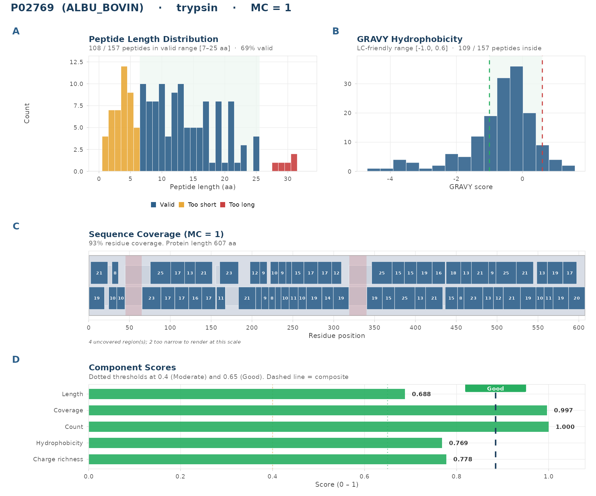
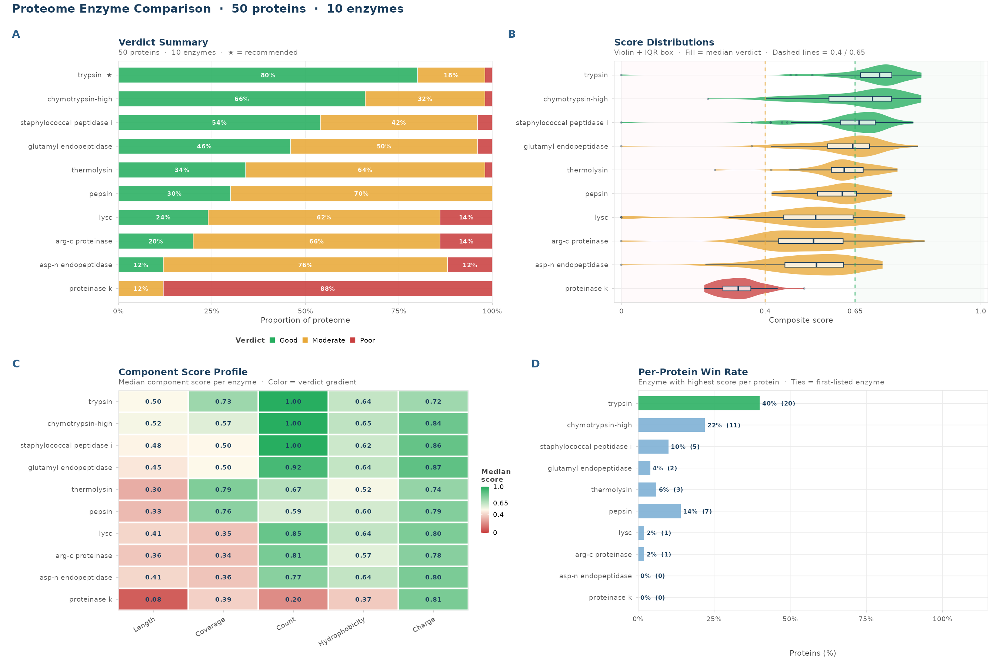

<!-- markdownlint-disable MD033 MD036 MD041 -->
<br/>
<p align="center">
  
</p>

<h1 align="center">pepVet</h1>

<p align="center">
  Evaluate proteolytic digests for LC-MS/MS proteomics. Score peptides, compare enzymes, triage proteins, and plan your workflow before any sample reaches the instrument.
</p>

<p align="center">
  
  = 4.6">
  
  <a href="https://github.com/LangeLab/pepVet/actions/workflows/R-CMD-check.yaml">
    
  </a>
  <a href="https://app.codecov.io/gh/LangeLab/pepVet">
    
  </a>
  <a href="LICENSE.md">
    
  </a>
  <a href="https://langelab.github.io/pepVet/">
    
  </a>
</p>

---

## What pepVet does

Enzyme choice affects the peptide set available to a bottom-up proteomics workflow. Frequent cleavage can produce many short fragments, while sparse cleavage can leave long products. pepVet compares enzyme-digest combinations using explicit length, coverage, peptide-count, hydrophobicity, and charge criteria. The resulting scores are intended for pre-acquisition ranking and review, not as predictions of peptide identification or experimental success.

## Quick start

```r
library(pepVet)

bsa <- system.file("extdata", "P02769.fasta", package = "pepVet")

# One-call evaluation with a compact console report
result <- pepvet_check(bsa, enzyme = "trypsin", missed_cleavages = 1L)
result$scores

# Multi-enzyme comparison
comp <- compare_digests(bsa,
  enzymes = c("trypsin", "lysc", "glutamyl endopeptidase", "asp-n endopeptidase")
)
digest_report(comp)
recommend_enzyme(bsa, enzymes = c("trypsin", "lysc"))
```

## Visualization

pepVet provides 14 ggplot2-based plot functions for digest diagnostics, enzyme comparison, physicochemical distributions, and proteome-scale overviews. Every function returns a ggplot or patchwork object that can be customized further.

**Single-protein diagnostic:** `plot_digest_profile()` called on BSA (`P02769.fasta`) digested with trypsin at one missed cleavage gives a four-panel figure showing length distribution, GRAVY hydrophobicity, sequence coverage, and component scores:

<p align="center">
  
</p>

**Proteome-scale enzyme comparison:** `plot_batch_comparison()` called on the 50-protein fixture (`small_proteome_50_proteins.fasta`) evaluated against 10 enzymes (trypsin, Lys-C, chymotrypsin, Asp-N, Glu-C, Arg-C, thermolysin, pepsin, Staphylococcal peptidase I, proteinase K) gives verdict summaries, score distributions, component heatmaps, and per-protein win rates:

<p align="center">
  
</p>

See the [Visualising Digest Quality](https://langelab.github.io/pepVet/articles/visualisation.html) article for the 12 general-purpose plots. The [Score Diagnostics](https://langelab.github.io/pepVet/articles/score-diagnostics.html) and [Weight Sensitivity Analysis](https://langelab.github.io/pepVet/articles/weight-sensitivity.html) articles cover the remaining two plots.

## Features

**Digest simulation**

- `digest_protein()` cleaves any protein sequence with any of 40 cleaver-compatible enzyme rules and returns a peptide tibble with coordinates and missed-cleavage counts.
- `annotate_cleavage_sites()` applies the package's high, medium, or low cleavage-efficiency categories to trypsin-family sites using local P1-P1' sequence context.

**Scoring**

- `score_peptides()` summarises a peptide set into five component scores (`S_length`, `S_coverage`, `S_count`, `S_hydro`, `S_charge`) plus an optional sixth (`S_unique`) when a background proteome digest is supplied.
- `pepvet_preset()` returns workflow-specific parameter sets for DDA, DIA, targeted, membrane, FFPE/degraded, and fractionated workflows.

**Evaluation and comparison**

- `evaluate_digest()` wraps digest and scoring into one call and returns a named list with scores, peptides, and resolved parameters.
- `compare_digests()` runs across a vector of enzymes for a single protein and returns a ranked tibble.
- `recommend_enzyme()` returns the enzyme or tied enzymes with the highest composite score under the selected settings.

**Batch workflows**

- `batch_evaluate()` evaluates every protein in a multi-FASTA independently and returns a flat tibble with one row per protein, including all score columns, verdicts, and four difficulty flags.
- `summarize_batch()` computes proteome-level verdict distribution, composite score statistics, per-component means, and heuristic enzyme-switch candidates.
- `triage_proteins()` appends an action column (proceed, consider_alternative, try_other_enzyme, skip) to the batch tibble.

Valid-count and hydrophobicity flags follow the active scoring ranges. Short-protein and low-complexity flags remain sequence-level heuristics.

**Reporting and export**

- `digest_report()` renders an ASCII-safe console summary for single-protein or multi-enzyme results and adapts comparison tables to the terminal width.
- `export_peptide_list()` filters valid peptides and exports as Skyline-compatible CSV, generic annotated CSV, or FASTA.

**Peptide properties**

- `calculate_peptide_mass()` computes monoisotopic neutral mass and m/z.
- `calculate_pI()` computes isoelectric point using a Lehninger-style pKa set.

## Scoring model

Six components, one weighted composite, one advisory verdict.

| Score        | What it measures                                                  | Role in the package model                                 |
| ------------ | ----------------------------------------------------------------- | --------------------------------------------------------- |
| `S_length`   | Fraction of peptides in the active length window [7, 25] aa       | Applies the selected peptide-length prior                 |
| `S_coverage` | Fraction of the protein covered by valid peptides                 | Rewards valid-peptide coverage across the source sequence |
| `S_count`    | Valid count relative to enzyme-aware expected density             | Compares the digest with an enzyme-specific count prior   |
| `S_hydro`    | Fraction of valid peptides in the active GRAVY window [-1.0, 0.6] | Applies the selected hydrophobicity prior                 |
| `S_charge`   | Valid peptides with non-terminal K/R/H                            | Records a basic-residue heuristic                         |
| `S_unique`   | Fraction of valid peptides unique in a supplied proteome          | Rewards absence from the supplied background digest       |

Default weights (AHP-derived, consistency ratio 0.028): `S_length` 0.200, `S_coverage` 0.348, `S_count` 0.226, `S_hydro` 0.138, `S_charge` 0.088.

Verdict thresholds: Good >= 0.65, Moderate >= 0.40, Poor < 0.40. These are heuristic ranking labels, not calibrated probabilities.

A zero `S_count` triggers the package's hard-fail rule. pepVet sets the composite score to zero and the verdict to Poor when an enzyme produces no cleavage sites or no peptides inside the active length window, regardless of the other component values.

## Workflow presets

Each preset adjusts the valid-length window, GRAVY range, and component weights together.

```r
preset <- pepvet_preset("targeted")
do.call(evaluate_digest, c(list(sequence = bsa, enzyme = "trypsin"), preset))
```

| Preset          | Intended context     | Package settings                                  |
| --------------- | -------------------- | ------------------------------------------------- |
| `standard`      | Routine DDA          | [7,25] aa, GRAVY [-1,0.6], default weights        |
| `dia`           | DIA and SWATH        | [7,30] aa, GRAVY [-1,0.8], larger coverage weight |
| `targeted`      | SRM, PRM, MRM        | [8,20] aa, GRAVY [-0.8,0.4], S_unique 30%         |
| `membrane`      | Hydrophobic proteins | GRAVY [-1.0,2.0], S_hydro 5%                      |
| `ffpe_degraded` | Degraded samples     | [6,30] aa, larger S_count weight                  |
| `fractionated`  | SCX / high-pH RP     | Standard settings with include_pI = TRUE          |

These presets are editable package priors. They do not establish experimental suitability for a sample or acquisition method.

## Installation

pepVet depends on Bioconductor packages. Install them first:

```r
if (!requireNamespace("BiocManager", quietly = TRUE))
  install.packages("BiocManager")
BiocManager::install(c("Biostrings", "IRanges", "cleaver"))

if (!requireNamespace("remotes", quietly = TRUE))
  install.packages("remotes")
remotes::install_github("LangeLab/pepVet", dependencies = TRUE)
```

## Reference FASTA fixtures

The package ships pinned FASTA files for reproducible examples and regression tests.

| File                               | Protein                            | Test or example role              |
| ---------------------------------- | ---------------------------------- | --------------------------------- |
| `P02769.fasta`                     | BSA (607 aa)                       | Reference digestion fixture       |
| `P68431.fasta`                     | Histone H3.1 (136 aa)              | Basic-protein digestion fixture   |
| `P56817.fasta`                     | BACE1 (501 aa)                     | Membrane-protein fixture          |
| `P00698.fasta`                     | Lysozyme C (147 aa)                | Small globular-protein fixture    |
| `Q8WZ42.fasta`                     | Titin (34350 aa)                   | Long-sequence scale fixture       |
| `P0CG48.fasta`                     | Polyubiquitin-C precursor (685 aa) | Repeated-sequence fixture         |
| `P37840_isoforms.fasta`            | Alpha-synuclein isoforms (3 seqs)  | Proteome-aware uniqueness example |
| `small_proteome_50_proteins.fasta` | 50 human proteins                  | Batch workflow fixture            |

## Scope

pepVet is not a peptide detectability predictor. It is a rule-based, multi-criteria digest-ranking model for pre-acquisition planning. Scores are interpretable rankings within a given enzyme-workflow combination, not calibrated probabilities. The model does not account for PTMs, chromatographic gradients, or instrument-specific fragmentation parameters.

## Documentation

- Full documentation site: [langelab.github.io/pepVet](https://langelab.github.io/pepVet/)
- Getting started: [pepVet-introduction](https://langelab.github.io/pepVet/articles/pepVet-introduction.html)
- Choosing an enzyme: [enzyme-selection](https://langelab.github.io/pepVet/articles/enzyme-selection.html)
- Workflow presets: [workflow-presets](https://langelab.github.io/pepVet/articles/workflow-presets.html)
- Scoring model: [scoring-model](https://langelab.github.io/pepVet/articles/scoring-model.html)
- Visualization gallery: [visualisation](https://langelab.github.io/pepVet/articles/visualisation.html)
- Changelog: [NEWS.md](NEWS.md)
- Bug reports and questions: [GitHub Issues](https://github.com/LangeLab/pepVet/issues)

## Citation

```r
citation("pepVet")
```

## License

MIT. See [LICENSE.md](LICENSE.md).

## Contributing

Pull requests, bug reports, and documentation fixes are welcome. See [CONTRIBUTING.md](CONTRIBUTING.md) for the review workflow and [CODE_OF_CONDUCT.md](CODE_OF_CONDUCT.md) for community standards.
